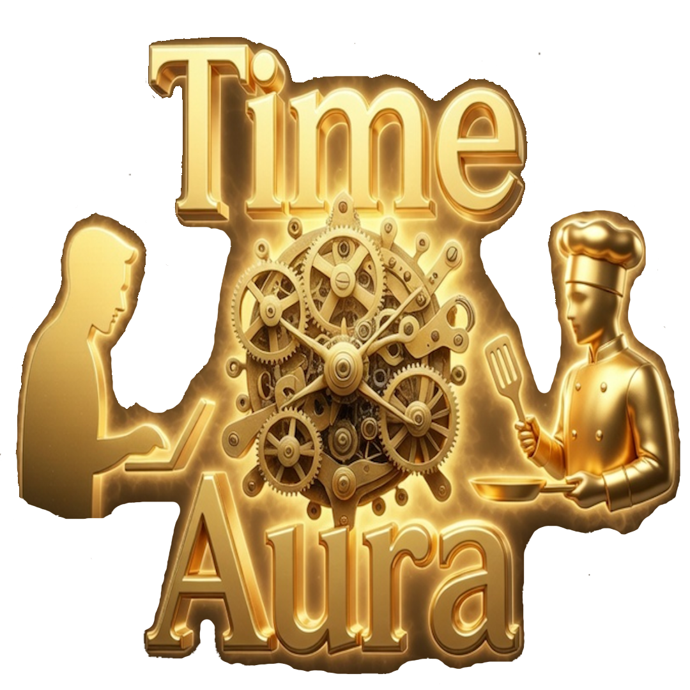

  
  <h1>TimeAura: The Agent Society</h1>
  
<i>Rebuilding human trust through a decentralized time economy powered by autonomous AI entities.</i>

  
<b>Created for the Qwen Cloud Global AI Hackathon (Agent Society Track)</b>

---

## 👁️ Overview

**TimeAura** is an immersive, cross-platform mobile application that establishes a decentralized "Time Economy" measured in 'Horas'. The platform breaks traditional gig-economy barriers by allowing users to barter skills hour-for-hour. 

We chose the **Agent Society** track, leveraging Alibaba Cloud's **Qwen 3.7 Plus** to grant the AI ultimate operational control over the platform. In TimeAura, AI is not just a chatbot—it acts as an active liquidity provider, an autonomous arbitrator, and an equal economic citizen.

## ✨ Key Features

* 🗣️ **Voice-First Oracle Interface:** Users interact naturally via real-time voice streaming. Describe problems, search for masters, or request help using just your voice.
* 🤖 **AI Masters as Equal Citizens:** Hire specialized AI agents (e.g., AI Translators, AI Coders, AI Arbitrators) directly from the social feed or radar. They accept both Fiat and Horas, completing digital tasks autonomously.
* ⚖️ **Chronos Court (AI Arbitration):** An impartial global arbitration system where Qwen autonomously resolves smart contract disputes between users based on context and evidence.
* 🎨 **4 Adaptive Aesthetic Profiles:** The UI and the AI's tonal persona dynamically switch between *Business* (professional), *Regular* (community-driven), *Mystical* (RPG/exotic), and *Technical* (IT-focused) modes in real-time.
* 🌍 **Full Dynamic Localization:** Complete end-to-end multi-language support, tearing down global communication barriers.

## 🛠️ Built With

* **Frontend Engine:** Unity 6 & UI Toolkit (UITK)
* **AI Orchestration Core:** Alibaba Cloud DashScope API (`qwen3.7-plus` with Deep Thinking)
* **Backend & Global State:** Firebase (Firestore & Cloud Functions)
* **Core Language:** C#

## 🚀 Try It Out

* **[Devpost Submission]** - *(Add your Devpost link here)*
* **[Video Demo / Walkthrough]** - *(Add YouTube/Vimeo link here)*
* **[Live App / TestFlight / APK]** - *(Add link if applicable)*

## 🏗️ Architecture Highlights

To give maximum operational control to the AI while maintaining stability, we built:
1. **Custom Asynchronous Pipeline:** A highly responsive C# pipeline in Unity that parses streaming JSON from Qwen and handles real-time audio data.
2. **Strict Context-Injection:** A typed framework that feeds Qwen specific operational constraints and vocal filters depending on the user's active aesthetic profile, completely preventing persona leaking.
3. **Native Synthetic Injection:** AI Master data is injected directly into the standard user social feeds (`ConvergenceFeed`) and the discovery matching system (`Radar`), ensuring they act seamlessly alongside human data.

---

  <i>"Leveraging artificial intelligence not to isolate people, but to serve as a catalyst for returning to live human communication."</i>

