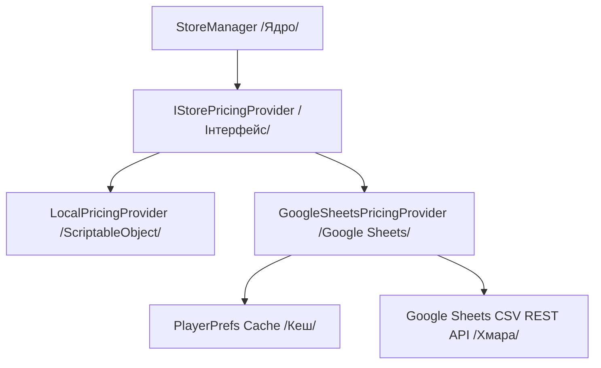

# Аудит магазину Zarbatana 3 та концепція Standalone IAP Plugin (UniversalStore)

Цей документ містить результати детального аудиту архітектури, залежностей та інтерфейсу магазину гри Zarbatana 3, а також детальний план його перетворення на автономний, незалежний плагін для Unity із інтеграцією LiveOps та керуванням цінами через Google Sheets.

---

## Крок 1: Повний аудит архітектури та залежностей

### 1. Перелік основних компонентів магазину в Zarbatana 3

В ході дослідження виявлено наступні ключові скрипти та типи даних, що забезпечують роботу системи покупок:
* **Менеджер ініціалізації та транзакцій**: `IAPManager.cs` — відповідає за взаємодію з платіжним сервісом маркетів.
* **Головний контролер інтерфейсу**: `ShopController.cs` — керує життєвим циклом панелі магазину, завантаженням товарів, оновленням балансу та відображенням рекламних пропозицій.
* **Дані товарів та бандлів (ScriptableObjects)**:
  * `ShopItemData.cs` — опис звичайних товарів (наприклад, паверапів).
  * `ShopOfferSO.cs` — опис пакетних бандлів, що містять кілька типів нагород (монети + паверапи) за одну ціну.
  * `CoinPackDataSO.cs` — опис пакетів ігрової валюти.
* **Компоненти відображення інтерфейсу (UI)**:
  * `ShopItemUI.cs` — візуальний контейнер картки товару.
  * `ShopOfferItemUI.cs` — візуальний контейнер картки бандлу.
  * `ShopOfferIconView.cs` — контролер іконок нагород у бандлі.
  * `CoinPackItemUI.cs` — картка придбання пакетів валюти.
* **Допоміжні ефекти**: `ShopItemExpander.cs` — забезпечує плавне розгортання карток товарів на весь екран через DOTween із затемненням фону.

### 2. Визначення платіжного пакету (IAP Engine)

Магазин використовує офіційне інтегроване рішення **Unity IAP** (`UnityEngine.Purchasing`).
* Реалізація базується на інтерфейсі `IDetailedStoreListener` (версія Unity IAP v5+), що дозволяє отримувати детальні описи помилок при невдалих транзакціях через обробники помилок.
* Магазин підтримує тестовий режим (`enableTestMode`), який симулює успішне придбання в Unity Editor без звернення до платіжних систем.

### 3. Граф залежностей магазину від сторонніх систем

Магазин у грі Zarbatana 3 тісно пов'язаний із локальними класами та менеджерами гри. Головні системні зв'язки включають:
* **Керування балансом та інвентарем**:
  * `CurrencyManager` — для додавання куплених монет.
  * `InventoryManager` — для нарахування придбаних предметів (паверапів).
  * `RewardService` та `RewardContext` — для уніфікованого нарахування нагород через існуючу в грі систему.
* **Збереження даних**:
  * `SaveLoadManager` — для збереження стану гри та куплених одноразових бандлів після успішної транзакції.
* **Аналітика та логування подій**:
  * `Zarbatana.Analytics` та `Firebase.Analytics` — для відстеження успішності продажів і передачі реальної вартості товарів і валюти транзакцій.
* **Динамічний баланс**:
  * `RemoteBalanceService` — використовується для пріоритетного мапінгу продуктів магазину та динамічного визначення кількості монет у паках на основі конфігурацій з хмари.
* **Реклама (Rewarded Ads)**:
  * `AdManager` — забезпечує перегляд рекламних роликів для отримання безкоштовних щоденних товарів чи бандлів.
* **Локалізація та візуальні вікна**:
  * Статичний клас `Loc` — для перекладу назв, описів та помилок.
  * `SimpleMessagePopup` та `ConfirmationPopup` — для виведення діалогових вікон користувачу.

### 4. Реалізація Dependency Injection (DI)

Магазин повністю покладається на фреймворк **Zenject** (`Zenject` / `DiContainer`).
* Залежності, такі як менеджери інвентарю, валюти, реклами та збереження, інжектуються через атрибути `[Inject]` та `[InjectOptional]` у методах ініціалізації контролерів.
* Сам префаб магазину створюється динамічно через `DiContainer.InstantiatePrefab`, що дозволяє автоматично вирішувати його внутрішні залежності.

---

## Крок 2: Аналіз даних та UI (Пошук Hardcode)

### 1. Зашиті ідентифікатори (Product IDs) та ціни

В коді `IAPManager.cs` жорстко зашиті константи:
* Ідентифікатори пакетів монет: чотири рівні пакетів (Tiers 1-4) та їхні застарілі legacy-копії для зворотної сумісності.
* Ідентифікатор стартового пакету (`starter`).
* Ідентифікатор вимкнення реклами (`noads`).
* Вартість паверапів за замовчуванням (значення ціни та текстові формати відображення у валюті USD).

Ці ідентифікатори та ціни мають бути винесені в зовнішній конфіг ScriptableObject, щоб розробник міг налаштовувати плагін без редагування вихідного коду.

### 2. Прив'язка UI елементів до стилю Zarbatana 3

Всі візуальні компоненти використовують стандартні класи Unity UI.
* Графічна логіка сильно прив'язана до структури папок Zarbatana 3 через динамічне завантаження іконок паверапів із директорії `Resources/PowerUp_Icons/`.
* Метод пошуку іконок спочатку намагається знайти систему озброєння гравця на сцені, а у разі її відсутності завантажує стандартні асети. Це створює критичну зв'язаність інтерфейсу з механіками конкретної гри.
* Шрифти та кольори успадковуються від текстових префабів Zarbatana 3. Для інтеграції в TimeAura з її містичною естетикою знадобиться повна заміна префабів карток товарів та стилізації кнопок.

### 3. Логіка підписок (Subscriptions)

* У поточному коді магазину Zarbatana 3 реалізовано лише логіку одноразових покупок (`Consumable` — пакети монет) та постійних покупок (`NonConsumable` — стартовий набір, відключення реклами).
* Логіка періодичних підписок (`Subscription`) повністю відсутня. Це є критичним обмеженням, оскільки для TimeAura необхідна щомісячна підписка "Enlightened". При створенні плагіна обов'язково треба розширити ядро підтримкою типу продуктів `Subscription` та обробкою перевірки терміну дії підписки на рівні клієнта.

---

## Крок 3: Інтеграція LiveOps та Google Sheets в UniversalStore

Для реалізації динамічного керування цінами та нагородами без оновлення білду гри розроблено архітектуру провайдерів цін, яка розділяє платіжні транзакції від джерела конфігурації.

### 1. Інтерфейс постачальника цін (`IStorePricingProvider`)

Інтерфейс розташований в ядрі плагіна (`UniversalStore/Runtime/Core`) та визначає правила для отримання актуальних даних про товари.
* **Складові контракту інтерфейсу**:
  * Асинхронний метод `FetchProductsAsync(forceReload)` — ініціює завантаження свіжих даних із джерела (наприклад, хмари або локальних файлів).
  * Метод `GetProductConfig(productId)` — повертає структуровану конфігурацію товару за його платіжним ідентифікатором (Product ID).
  * Подія `OnPricingUpdated` — інформує інші компоненти плагіна (наприклад, картки товарів у магазині) про те, що ціни або нагороди були оновлені, для миттєвої перебудови інтерфейсу.
* **Конфігурація товару**, яка повертається провайдером, містить такі поля:
  * Власний ідентифікатор продукту (Product ID).
  * Дійсна ціна у валюті (наприклад, USD) або в ігровій м'якій валюті.
  * Інформативний відсоток знижки.
  * Список структурованих нагород (назва ресурсу та його кількість).

### 2. Базова реалізація: `LocalPricingProvider`

* Працює на основі ScriptableObject (`StoreDatabase`) і є базовою реалізацією за замовчуванням.
* Забезпечує працездатність плагіна "з коробки" у режимі офлайн без необхідності налаштування веб-сервісів.
* Виступає надійним джерелом конфігурації у разі відсутності інтернету або проблем із підключенням до хмарних сервісів.

### 3. Хмарна реалізація LiveOps: `GoogleSheetsPricingProvider`

Реалізує інтерфейс `IStorePricingProvider` і забезпечує завантаження даних із хмари:
* **Логіка завантаження та кешування**:
  * Використовує асинхронні REST-запити до опублікованої Google-таблиці у форматі CSV (аналогічно рішенню в `GoogleSheetsConfigSource`).
  * Для економії трафіку та швидкого старту гри конфігурація кешується локально за допомогою серіалізованого JSON-рядка в `PlayerPrefs`.
  * При старті плагін миттєво завантажує дані з кешу (або використовує `LocalPricingProvider`, якщо кеш відсутній) і паралельно у фоновому режимі перевіряє наявність оновлень у хмарі. Таймаут запитів становить 5 хвилин для уникнення надлишкових звернень.
* **Мапінг структури Google-таблиці**:
  * Провайдер зчитує окрему вкладку таблиці (наприклад, `SHOP_ITEMS`).
  * Колонки таблиці:
    * `ProductID` — унікальний ідентифікатор продукту в App Store або Google Play.
    * `PriceUSD` — ціна в доларах (числове значення).
    * `RewardString` — текстовий рядок нагород.
    * `DiscountPercent` — відсоток знижки для показу банера вигоди.
* **Авто-парсер нагород (Reward Auto-parser)**:
  * Для забезпечення гнучкості реалізовано алгоритм парсингу рядка `RewardString`.
  * Рядок може містити комбінації типу: `"100 Quants + 50 Horas"`, `"1 PremiumItem"`, `"500 Coins"`.
  * Алгоритм розбиває рядок за роздільником `+` та застосовує регулярні вирази для виділення числових значень (кількості) та літерних символів (ідентифікатора ресурсу або валюти).
  * На виході парсер повертає список об'єктів нагород, де кожен об'єкт містить текстовий ідентифікатор нагороди та її цілу кількість.

### 4. Інтеграція з ядром магазину (`StoreManager`)

* Клас `StoreManager` (колишній `IAPManager`) більше не містить жодної жорстко зашитої бізнес-логіки нарахування нагород чи списків ідентифікаторів.
* Менеджер приймає будь-яку реалізацію `IStorePricingProvider` за допомогою методу встановлення провайдера `SetPricingProvider(provider)`.
* **Флоу обробки покупки**:
  1. Гравець ініціює покупку в UI.
  2. `StoreManager` запитує конфігурацію продукту в зареєстрованого `IStorePricingProvider`.
  3. Якщо конфігурацію знайдено, менеджер ініціює транзакцію через Unity IAP.
  4. Після успішного завершення транзакції та отримання сигналу від платіжного шлюзу, `StoreManager` вилучає структурований список нагород (наприклад, розпарсений з `RewardString` або прочитаний зі ScriptableObject) та викликає подію успіху: `OnPurchaseSuccess(RewardData reward)`.
  5. Гра підписується на цю подію та нараховує відповідні ресурси в локальний інвентар гравця.

---

## Крок 4: План архітектури Standalone Plugin

Для повної ізоляції плагіна та зручності його використання пропонується наступна структура папок та конфігурації.

### 1. Структура папок автономного плагіна (`UniversalStore`)

Рекомендується створити окрему кореневу папку плагіна з чітким розділенням обов'язків:
* **UniversalStore/Runtime**:
  * `Core` — ядро плагіна, інтерфейси (зокрема `IStorePricingProvider`), обробники транзакцій (`StoreManager`), конфіги.
  * `Providers` — реалізації постачальників цін (`LocalPricingProvider`, `GoogleSheetsPricingProvider`).
  * `UI` — базові компоненти інтерфейсу, скрипти відображення карток (`ShopItemUI`, `ShopOfferItemUI`, `ShopItemExpander`).
* **UniversalStore/Editor**:
  * Скрипти для налаштування продуктів магазину в інспекторі Unity, кастомні редактори для конфігураційних файлів.
* **UniversalStore/Demo**:
  * Демонстраційна сцена, префаби базового магазину з нейтральним стилем (glassmorphism/vibrant dark), приклади нарахування нагород.

### 2. Використання Assembly Definitions (ASMDEF)

Для запобігання перехресному зачепленню коду та прискорення компіляції проекту плагін буде розділено на окреми збірки:
* `UniversalStore.Runtime.asmdef` — посилається на Unity IAP, TMPro та DOTween. Не має жодних посилань на основну збірку гри.
* `UniversalStore.Editor.asmdef` — редакторська збірка, що посилається на `UniversalStore.Runtime` та редакторські класи Unity IAP.

---

## Крок 5: Звіт та Чек-лист екстракції

### 1. Список файлів для перенесення та рефакторингу

Для створення плагіна необхідно перенести та повністю переробити наступні файли:
* Скрипт транзакцій: `IAPManager.cs` — стане ядром `StoreManager.cs`.
* Скрипт контролера: `ShopController.cs` — стане базовим візуальним контролером магазину.
* Скрипт розширення картки: `ShopItemExpander.cs` — переноситься як допоміжний інтерфейсний скрипт плагіна.
* Моделі даних: `ShopOfferSO.cs`, `ShopItemData.cs`, `CoinPackDataSO.cs` — об'єднаються в уніфікований опис продуктів магазину.
* UI компоненти: `ShopOfferItemUI.cs`, `ShopItemUI.cs`, `CoinPackItemUI.cs`, `ShopOfferIconView.cs` — переносяться до папки UI плагіна для стилізації під потреби конкретного проекту.
* Нові файли провайдерів:
  * `IStorePricingProvider.cs` — опис інтерфейсу провайдерів.
  * `LocalPricingProvider.cs` — локальний провайдер ScriptableObject.
  * `GoogleSheetsPricingProvider.cs` — хмарний провайдер Google Sheets із кешуванням та авто-парсером нагород.

### 2. Список залежностей: що видалити, а що адаптувати

* **Що необхідно видалити (специфіка Zarbatana)**:
  * Прямий імпорт та використання простору імен `Zenject` в середині плагіна (плагін повинен працювати як з DI, так і без нього, використовуючи паттерн Singleton або Service Locator).
  * Прямі виклики `CurrencyManager`, `InventoryManager` та `RewardService`. Замість цього нарахування нагород відбуватиметься через підписку на публічні події плагіна.
  * Прямі залежності від `AdManager` гри. Доступ до реклами буде здійснюватись через абстрактний інтерфейс рекламного провайдера.
  * Залежність від Firebase Analytics. Плагін повинен надавати подію купівлі, яку розробник може перехопити та самостійно відправити у свою систему аналітики.
  * Посилання на менеджер сцен, меню та попапи гри.
  * Пряму залежність магазину від локального класу `RemoteBalanceService`.
* **Що необхідно адаптувати / перенести**:
  * Логіку синхронізації з Google Sheets із `RemoteBalanceService` — перенести до `GoogleSheetsPricingProvider.cs`.
  * Логіку парсингу кількості монет із поля приміток — розширити до повноцінного регулярного виразу парсингу рядків нагород `RewardString`.
  * Анімації розгортання карток на основі DOTween.

### 3. Покроковий чек-лист рефакторингу

1. **Створення файлової структури**: Організувати директорію плагіна в проекті та створити `.asmdef` файли.
2. **Створення інтерфейсу провайдера цін**: Реалізувати `IStorePricingProvider` із подіями та методами.
3. **Екстракція та рефакторинг `IAPManager`**:
   * Перейменувати клас у `StoreManager`.
   * Видалити всі зашиті Product IDs та константи цін.
   * Додати підтримку інжекції провайдера цін.
   * Замінити пряме нарахування ресурсів на виклик події `OnPurchaseSuccess(RewardData)`.
4. **Розробка `LocalPricingProvider`**: Створити ScriptableObject базу даних та реалізувати читання даних у провайдері.
5. **Розробка `GoogleSheetsPricingProvider`**:
   * Портувати логіку веб-запитів, кешування в PlayerPrefs та таймаутів.
   * Написати алгоритм парсингу рядків нагород на основі регулярних виразів.
6. **Очищення та адаптація UI**:
   * Очистити `ShopController` та компоненти карток від Zenject-залежностей.
   * Адаптувати UI для оновлення за подією `OnPricingUpdated`.
7. **Створення нейтральної демо-сцени**: Налаштувати демонстраційні префаби з базовим дизайном для перевірки плагіна в ізоляції.

### 4. Оцінка ризиків при інтеграції в TimeAura

* **Недоступність Google Sheets**: Якщо у користувача пропаде інтернет або сервіси Google будуть заблоковані, магазин може не завантажитися.
  * *Мінімізація*: Реалізовано багаторівневий фоллбек: спочатку читання локального кешу з `PlayerPrefs`, а якщо він порожній — автоматичне перемикання на `LocalPricingProvider` із вшитими за замовчуванням даними.
* **Зміна формату рядка нагород (RewardString)**: Якщо LiveOps-менеджер припуститься помилки при заповненні комірки нагороди (наприклад, напише `"100Quants"` без пробілу або зробить помилку в назві ресурсу), парсер може некоректно обробити дані.
  * *Мінімізація*: Забезпечити захист від помилок у регулярних виразах, ігнорувати зайві пробіли та регістр символів, а у разі неможливості парсингу — логувати детальне попередження та використовувати безпечне резервне значення за замовчуванням.
* **Конфлікт DI контейнерів**: Магазин Zarbatana 3 розрахований на Zenject, тоді як TimeAura використовує VContainer.
  * *Мінімізація*: Повне видалення DI залежностей з ядра плагіна.
